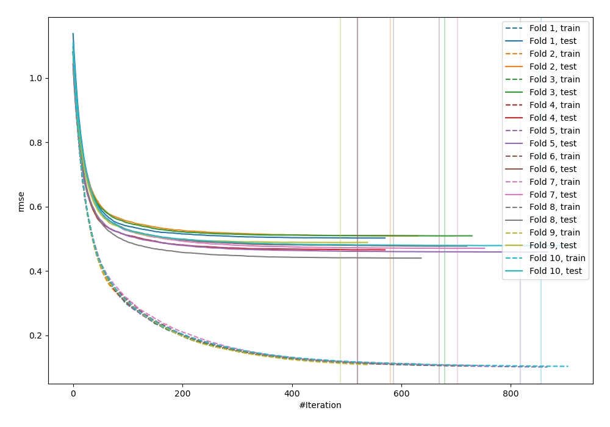

# Summary of 61_Xgboost_GoldenFeatures

[<< Go back](../README.md)

## Extreme Gradient Boosting (Xgboost)
- **n_jobs**: -1
- **objective**: reg:squarederror
- **eta**: 0.05
- **max_depth**: 9
- **min_child_weight**: 25
- **subsample**: 0.8
- **colsample_bytree**: 0.9
- **eval_metric**: rmse
- **explain_level**: 0

## Validation
 - **validation_type**: custom

## Optimized metric
rmse

## Training time

286.6 seconds

### Metric details:
| Metric   |     Score |
|:---------|----------:|
| MAE      | 0.367887  |
| MSE      | 0.338481  |
| RMSE     | 0.581791  |
| R2       | 0.769221  |
| MAPE     | 0.0563042 |

## Learning curves

## True vs Predicted

## Predicted vs Residuals

[<< Go back](../README.md)
